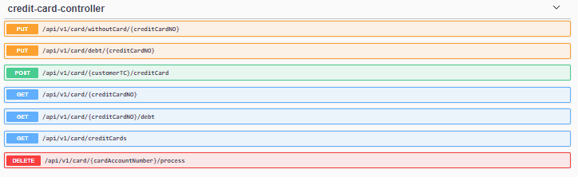
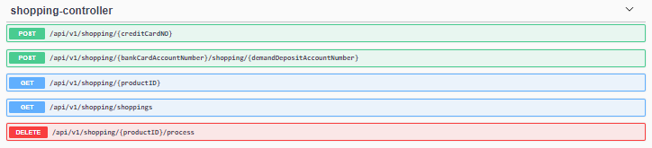
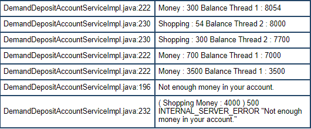

# Kodluyoruz Fibabanka Java Bootcamp Bitirme Projesi Sunumu


 ## Tanıtım

Merhaba ben İsa SAYAR, Düzce Üniversitesi Bilgisayar Mühendisliği Bölümünden 2020 yılı Sonbaharında mezun oldum. Mezun olduktan sonra Java ve C# programlama dillerine yoğunlaştım ve bu diller ile Masaüstü ve Web uygulamaları geliştirmeye başladım. Bunların haricinde clean code yazmaya, SOLID ve Desing Patterns öğrenmeye çalıştım. Kasım'ın sonu gibi Sosyal platform aracılığı ile de Kodluyoruz'un Fibabanka destekli Java Bootcamp'i düzenlediğini gördüm ve bende neden olmasın diyerek başvuruda bulundum. Şu anda da bu noktaya kadar geldim.

## İçindekiler

- Proje Tanımı
- Veri tabanı Tasarımı
- Paket Yapısı
- End Points
- Senaryolar
- Proje Kapsamında Yapılan Algoritmik Çözümlemeler
- Alınabilecek Hatalar
- Log Kayıtları
- Kullanılan Teknolojiler
- Proje Kapsamında Kullanılan Kaynaklar

## Proje Tanımı

Online Bankacılık Sisteminin Backend'inin yazılması.

- Müşteri Yönetimi
- Hesap Yönetimi
- Kart Yönetimi
- Transfer Yönetimi (https://api.exchangeratesapi.io/latest?base=TRY) api den güncel para kurları çekilerek yapılacak.

## Veritabanı Tasarımı


Veritabanı diyagramında da görüldüğü gibi hesap türleri ve card çeşitleri  farklı tablolarda tutuluyor. Kredi kartı müşteri ile ilişkilendirilmişken bank card müşteri ile ilişkilendirilmedi onun yerine bank card ve müşteri hesaplar ile ilişkilendirildi. Bu şekilde hesap bilgilerinden bank card ve müşteri bilgilerine ve müşteriden de hesap ve kredi kartı bilgilerine ulaşılabilecektir. Ayrıdan da hesap özet bilgilerini ve kartlar kullanılarak da alışveriş yapılabildiğini göstermek amacı ile de Shopping tablosu oluşturuldu.

## Paket  Yapısı

 


## End Point

- ### Bank Card Endpoints

  

- Credit Card Endpoints

  

- Customer Endpoints

  

- Demand Deposit Account Endpoints

  

- Exchange Endpoints

  

- Extract of Account Endpoints

  

- Savings Account Endpoints

  

- Shopping Endpoints

  

  

## Senaryolar


### Senaryo 1

Uygulamamızda Birikim hesabı ve vadesiz mevduat hesapları oluşturulabiliyoruz. Senaryoda birikim hesabınız da olan paranın nasıl    değerlendiğini yani biriktiğine değineceğim.

İlk olarak birikim hesabı banka müşterilerinin birikim yapmalarına olanak tanıyan aynı zamanda paraya faiz uygulayan bir hesap türü. Bu hesabın avantajlarından en güzeli ise paranızı biriktirmeye başladığınız an belirlenen vade sonunda ne kadar kazanacağınızı görebilirsiniz.

- ### Birikim Faiz Hesaplama


Faiz brüt olarak şu şekilde hesaplanır: Anapara * faiz oranı * vade (gün sayısı) / (36500)   (365 gün sayısı, 100 de faiz oranı yüzdesi)(Faiz oranı yıllık olarak alınıyor.)

Net kazanç -> Brüt faiz getirisinden mevduat vadesine denk gelen gelir vergisinin  (stopaj) düşürülmesi ile hesaplanır. Hesabı ise şu şekildedir. 

Net kazanç = Brüt kazanç - (Brüt kazanç * stopaj vergisi) , şeklinde net kazanç hesaplanır ve sizin ana paranız üzerine eklenir.

! Birikim hesabı (Mevduat faiz getirisi) stopaj oranları :

Türk Lirasında 6 ay a kadar %5, Dolar ve Euro da ise %20 olarak ele alınır. Proje kapsamında bu değerler kullanılmaya çalışılacaktır.

** Stopaj Vergisi (**kaynaktan kesme**), gelir vergisinde, özellikle maaş ve ücretlilerin vergi borçlarının ödenmesinde, gelir henüz sahibinin eline geçmeden verginin kesilmesini ifade eder.)

### Senaryo 2

Bu senaryomuz ise şu şekilde; 

ATM' den banka kartını kullanarak para çekerken aynı zamanda kart bilgilerini kullanarak online alışveriş yapılabildiğini düşünelim. Para çekme ve alışveriş işlemlerinin son kısmındayken yani tam para çekme ve ödeme işlemi yaparken müşterinin bu durum sonucunda doğru bir cevap alması gerekir. Çünkü işlem olarak para çekme yaptığımızda bakiye de belirli miktar para kalıyor ve aynı zamanda alışveriş için bakiye yetersiz kalabilir. Bu durum alışveriş işlemi içinde geçerli.  Bu işlemlerin eş zamanlı gerçekleşme olasılığı olabilir.





## Proje Kapsamında Yapılan Algoritmik Çözümlemeler

### Senaryo 1

- Vadesiz mevduat hesaplarında, birikim hesaplarında parası bulunan ve kredi kartı borcu bulunan müşterilerin sistemden silinme işlemi yapılamayacaktır. (Fakat müşteri dilerse hesaplarını kapatabilir ya da kredi kartı kullanımını bırakabilir (burada da yukarıdaki şartları yerine getirmeli) fakat banka dan tamamen ilişiğini kesmek için belirtilen koşulu sağlaması gerekir.)
- Müşteri üzerinden vadesiz mevduat hesabındaki para miktarı bir listeye atanır. 
- Müşteri üzerinden birikim hesabındaki para miktarı bir listeye atanır.
- Müşteri üzerinden kredi kartındaki borç bilgisi bir listeye atanır.
- Bu listede para değerleri tutulmaktadır. 
- Bir metoda bu liste parametre olarak gönderilmektedir.
- Bu metod ise gelen liste üzerinde bir counter tutulmakta ve bu counter gelen değerler üzerinde eğer değer 0'a eşit ise 1 artmaktadır. son olarak da counter ile parametre olarak gelen listenin boyutu eşit ise true olarak döner. Bu şekilde müşterinin hesaplarında parasının ve kredi kartında borcu olmadığını anlamış oluyoruz.

```java
    public void delete(long customerTC) {
        Customer deletedCustomer = customerRepository.findCustomerByCustomerTC(customerTC);
        List<Integer> debts = deletedCustomer.getCreditCards().stream().map(CreditCard::getCardDebt).collect(Collectors.toList());
        boolean isCreditCardDelete = isZero(debts);
        // ...
    }
    private final Predicate<List<Integer>> isZero = moneyAmounts -> {
        int counter = 0;
        for (Integer money : moneyAmounts) {
            if (money == 0) {
                counter++;
            }
        }
        return counter == moneyAmounts.size();
    };
```

! Bu şekilde olma amacı bir kullanıcının birden fazla kredi kartı bulunabilir ve bu kredi kartlarında borçlar göz önüne alınmıştır. Aynı zamanda kullanıcının birden fazla hesabı göz önüne alınarak da değerlendirilmiştir.

### Senaryo 2

Güncel para kuru kullanılarak para birimleri arasında dönüşüm yapılabilmektedir. Örnek olarak hesabınız TRY para biriminde siz USD ya da EUR para birimlerine sahip bir hesaba para göndereceğiniz zaman dönüşüm işlemi yapılmaktadır. Ya da hesabınız EUR biriminde fakat siz kredi kartı borcunuz TRY türünde ve bu işlemler doğrultusunda ödeme işlemlerinde dönüşüm yapılarak işlemler doğru bir şekilde yerine getiriliyor. 

Güncel para kuru  (https://api.exchangeratesapi.io/latest?base=TRY) bu url baz alınarak yapılmaktadır. 

Uygulama içerisinde ise 


Yukarıdaki resim de convertProcess metodu uygulama içerisinde ihtiyaç duyulan yerlerde çağrılmaktadır. İlk parametre ile hangi para biriminden hangi para birimlerine dönüşüm yapılacak ise ona göre güncel kur çekilmektedir. 2 . parametre de ise hangi para birimine çevrilecek ise onun ilk parametre de belirtilen para birimi karşısındaki değeri çekiliyor. Money alanında ise ne kadar paranın çevrileceği veriliyor. Return işlemin de ise eğer para birimleri eşit ise çevirme işlemi yapılmıyor. Eğer para birimleri farklı ise çekilen değer ile parametre olarak verilen para birimi çarpılıyor.

Örnek olarak 1 USD TRY karşılığındaki güncel değeri 7.0209 

## Alınabilecek Hatalar 

### Senaryo 1

Müşterinin kredi kartı ile alışveriş yaptığını ve müşterinin limiti aşacak bir alışveriş yapması durumunda alacağı hata aşağıdaki resimde görülmektedir.


### Senaryo 2

Müşterinin farklı bir hesaba IBAN ile para gönderme işleminde IBAN' ı yanlış girmesi durumunda karşılaşacağı hata ise aşağıda gösterilmektedir.


## Log Kayıtları

Uygulama içerisinde yapılan işlemleri ve kullanıcının karşılaştığı hataları log4j kullanarak kayıt altına almaktayım.


## Kullanılan Teknolojiler

- Java, Spring Boot, Spring MVC, Spring Data JPA,Maven, Swagger, Postman, MySql, Rest API, JUnit5, Mockito, log4j

## Proje Kapsamında Kullanılan Kaynaklar

- [Java Documentation](https://github.com/hkarabakla/hello_java)

- [Baeldung](https://www.baeldung.com/)

- [Stackoverflow](https://stackoverflow.com/)

- [Spring](https://spring.io/projects/spring-boot)

- [TutorialsPoints](https://www.tutorialspoint.com/spring/index.htm)

- [Mockito](https://site.mockito.org/)

- [JUnit](https://junit.org/junit5/docs/current/user-guide/)

  

  