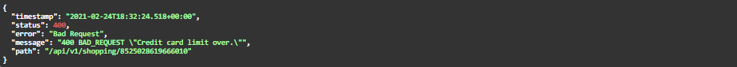

# Kodluyoruz Fibabanka Java Bootcamp Bitirme Projesi Sunumu


 ## Tanıtım

Merhaba ben İsa SAYAR, Düzce Üniversitesi Bilgisayar Mühendisliği Bölümünden 2020 yılı Sonbaharında mezun oldum. Mezun olduktan sonra Java ve C# programlama dillerine yoğunlaştım ve bu diller ile Masaüstü ve Web uygulamaları geliştirmeye başladım. Bunların haricinde clean code yazmaya, SOLID ve Desing Patterns öğrenmeye çalıştım. Kasım'ın sonu gibi Sosyal platform aracılığı ile de Kodluyoruz'un Fibabanka destekli Java Bootcamp'i düzenlediğini gördüm ve bende neden olmasın diyerek başvuruda bulundum. Şu anda da bu noktaya kadar geldim.

## Proje Tanımı

Online Bankacılık Sisteminin Backend'inin yazılması.

- Müşteri Yönetimi
- Hesap Yönetimi
- Kart Yönetimi
- Transfer Yönetimi (https://api.exchangeratesapi.io/latest?base=TRY) api den güncel para kurları çekilerek yapılacak.

## Veritabanı Tasarımı


Veritabanı diyagramında da görüldüğü gibi hesap türleri ve card çeşitleri  farklı veri tabanında tutuluyor. Kredi kartı müşteri ile ilişkilendirilmişken bank card müşteri ile ilişkilendirilmedi onun yerine bank card ve müşteri hesaplar ile ilişkilendirildi. Bu şekilde hesap bilgilerinden bank card ve müşteri bilgilerine ve müşteriden de hesap ve kredi kartı bilgilerine ulaşılabilecektir. Ayrıdan da hesap özet bilgilerini ve kartlar kullanılarak da alışveriş yapılabildiğini göstermek amacı ile de Shopping veri tabanı oluşturuldu.

## Senaryolar


### Senaryo 1

Uygulamamızda Birikim hesabı ve vadesiz mevduat hesapları oluşturulabiliyoruz. Senaryoda birikim hesabınız da olan paranın nasıl    değerlendiğini yani biriktiğine değineceğim.

İlk olarak birikim hesabı banka müşterilerinin birikim yapmalarına olanak tanıyan aynı zamanda paraya faiz uygulayan bir hesap türü. Bu hesabın avantajlarından en güzeli ise paranızı biriktirmeye başladığınız an belirlenen vade sonunda ne kadar kazanacağınızı görebilirsiniz.

- ### Faiz Hesaplama


Faiz brüt olarak şu şekilde hesaplanır: Anapara * faiz oranı * vade (gün sayısı) / (36500)   (365 gün sayısı, 100 de faiz oranı yüzdesi)(Faiz oranı yıllık olarak alınıyor.)

Net kazanç -> Brüt faiz getirisinden mevduat vadesine denk gelen gelir vergisinin  (stopaj) düşürülmesi ile hesaplanır. Hesabı ise şu şekildedir. 

Net kazanç = Brüt kazanç - (Brüt kazanç * stopaj vergisi) , şeklinde net kazanç hesaplanır ve sizin ana paranız üzerine eklenir.

! Birikim hesabı (Mevduat faiz getirisi) stopaj oranları :

Türk Lirasında 6 ay a kadar %5, Dolar ve Euro da ise %20 olarak ele alınır. Proje kapsamında bu değerler kullanılmaya çalışılacaktır.

** Stopaj Vergisi (**kaynaktan kesme**), gelir vergisinde, özellikle maaş ve ücretlilerin vergi borçlarının ödenmesinde, gelir henüz sahibinin eline geçmeden verginin kesilmesini ifade eder.)

### Senaryo 2


Senaryo 2 ise Kredi kartı borcu ödeme, Kredi kartı ile 1 ay içerisinde ve belirtilen limit altında yapılan işlemler sonucunda kullanıcının bankaya ödemesi gereken bir ücret ortaya çıkmaktadır bu da dönem borcu olarak bilinir. Kullanıcı bu ücreti hesap kesim tarihi ile belirlenen son ödeme tarihleri arasında bankaya ödemesi gerekmektedir. (Uygulama kapsamında hesap kesim tarihi ile son ödeme tarihi arasında 10 gün -  Son ödeme tarihi ile bir sonraki hesap kesim tarihi arasında ise 20 gün süre baz alınmıştır.) Müşteri bankaya belirlenen oran doğrultusunda asgari ödemesi gereken tutarı öder ise kartı belirli bir süre daha kullanmaya devam eder.  

Uygulama içerisinde, Müşteri dönem borcunu belirtilen tarihler arasında öder ise bir faiz işlemi uygulanmaz. Fakat dönem borcu yerine asgari tutarı öder ise bir sonraki ay a dönem borcuna alışveriş faizi ve gecikme faizi gibi faizler uygulanıyor.

- Alışveriş Faiz Tutarı : Ödenmeyen tutara hesap kesim tarihinden son ödeme tarihine kadar gecikme faizi uygulanır. Hesaplama ise şu şekilde yapılır : 

  ​							alışveriş faiz tutarı * = (ödenmeyen kısım * faiz oranı * (10/30) ) / 100 (faiz oranı yüzdesi)

- Gecikme Faizi : Asgari tutarın ödenmeyen kısmına son ödeme tarihinden bir sonraki hesap kesim tarihine kadar gecikme faizi uygulanır. Şu şekilde hesaplanır : 

  ​							gecikme faiz tutarı = (asgari ödenmeyen para * gecikme faiz tutarı * (20/30) ) / 100 (faiz oranı yüzdesi)

- ** Alışveriş Faiz Tutarı : Son ödeme tarihinden bir sonraki hesap kesim tarihine kadar alışveriş faizi uygulanır. Hesaplama ise şu şekilde yapılır.

  ​						   alışveriş faiz tutarı ** = (Kalan para * alışveriş faiz oranı * (20/30) ) / 100

- Toplam faiz tutarı ise yukarıdaki hesaplamalardaki oluşan değerleri toplayarak elde edilir. Bu toplam faiz tutarı da Müşterinin dönem borcuna yansıtılır.

Not : Uygulama kapsamında Fiba Banka Kredi Kartı Faiz oranları baz alınmıştır. 

* 28.01.2021 tarihinden itibaren ;
  * Alışveriş Faiz Oranı (TL) : % 1.79
  * Gecikme Faiz Oranı (TL) : % 2.09 

### Senaryo 3

Üçüncü senaryomuz ise şu ; 

ATM' den banka kartını kullanarak para çekerken aynı zamanda kart bilgilerini kullanarak online alışveriş yapılabildiğini düşünelim. Para çekme ve alışveriş işlemlerinin son kısmındayken yani tam para çekme ve ödeme işlemi yaparken müşterinin bu durum sonucunda doğru bir cevap alması gerekir. Çünkü işlem olarak para çekme yaptığımızda bakiye de belirli miktar para kalıyor ve aynı zamanda alışveriş için bakiye yetersiz kalabilir. Bu durum alışveriş işlemi içinde geçerli.  Bu işlemlerin eş zamanlı gerçekleşme olasılığı olabilir.

Bu işlemler para çekme ve harcama durumu olduğu için bakiyenin çekilen ya da harcanan miktar çıkartılarak bakiye güncelleniyor. Bu işlem arka tarafta bir metot ile yapılıyor.  Para çekme ve alışveriş işleminde bakiye güncellemek için yani 2 durum için ortak kullanılan metoda ilk ulaşan işlemini yapacak ve bu işlemi yaparken diğer durum, işlem yapanı bekleyecek. Bu işlemde synchronized blok ile yapılıyor. Yani ilk gelen lock objesini kapıyor ve diğer işlem, ilk gelen işlemin bitmesini bekliyor.

Metoda hesap numarası ve para miktarı parametre olarak gönderiliyor. Hesap numarası ile veri tabanından güncel bakiye bilgisi çekiliyor. Bakiye bilgisi alındıktan sonra işlemi yapan durum ilk olarak bakiye kontrolü yapıyor eğer, bakiye çekilecek ya da alışveriş durumunda ödenecek miktardan az ise işlem yapılamayacak. Eğer bakiye kontrol durumu para çekme ya da alışveriş sonucunda ödenecek parayı karşılayabiliyor ise işlemler yapılabilecektir. İşlemi yapan durum yani para miktarı güncellendikten sonra yeni bakiye veri tabanına kaydediliyor. Bunun nedeni sırada bekleyen diğer işlemde güncel bakiye bilgisi çekerek işlemi yapacaktır. Aksi halde işlemler yapılır fakat bakiye istenilen sonucu vermez. 

!NOT : Bu senaryo için 2 farklı örnek yapıldı uygulama içinde ilk örnek son işlemlerin yapıldığı yani tam para işleminin çekilme esnasında ve online alışveriş senaryosunda ödeme işlemi yapılacağı kısım düşünülerek yapıldı. İkinci senaryo ise para çekme ve online alışveriş yapılması yani ürünün ne olduğu ne kadar fiyat ile alınacağı gibi bir örnek hazırlandı.

Örnek 

Bakiye : 1000 

ATM den çekilecek miktar : 500

Online alışveriş sonucunda ödenecek tutar : 300,

İlk olarak metoda ATM den para çekme işleminin ulaştığını varsayalım, 1000 > 500 den büyük yani para çekmek için yeterli bakiye var, Para çekiliyor ve güncel bakiye (1000-500 = 500)  veri tabanına kayıt ediliyor.

Para çekme işleminden sonra, sırada bekleyen online alışveriş durumu işlemini yapacaktır. Bu işlem de aynı şekilde hesap numarasını kullanarak güncel bakiyeyi çekiyor. Bu bakiye ile de önceden bakiye güncellendiyse güncel bilgileri kullanmak amacı ile çekiliyor. Bu işlemden sonra online alışveriş de ödenecek tutar ile bakiye kontrolü yapılıyor. Bu kontrol sonucunda bakiye 500 > 300 olduğu için alışveriş işlemi de başarı ile işlemini yapacaktır. Bu işlem sonucunda güncel bakiye bilgisi (500 - 300 = 200) veri tabanına kayıt edilecektir.

Bakiye : 200

ATM den çekilecek miktar : 150

Online alışveriş sonucunda ödenecek tutar : 100,

Bu senaryoda da Online işlemin arka tarafta ilk olarak işlem yapacağını varsayalım. Online işlem önceki örnekteki ile aynı adımlar ile işlemi yapacak ve bakiye kontrol durumunda 200 > 100 olduğu için alışveriş işlemi yapılacak. Güncel bakiye bilgisi veri tabanında güncellenecek. Bu işlem bittikten sonra ATM den para çekme işlemi, metot da işlemi yaparken bakiye kontrolünde çekmek istediği tutar bakiye durumunu aştığı için yani 100 > 150 durumu olamayacağı için, Hesabınızda yeterli bakiye yoktur hatası alacak.

Bu senaryoda işlemler sonucunda işlem yapılan hesap geri kullanıcıya gösteriliyor. (Bu senaryo 2 farklı anonim thread oluşturularak denendi ve çalıştı.)

## Proje Kapsamında Yapılan Algoritmik Çözümlemeler

### Senaryo 1

- Vadesiz mevduat hesaplarında parası bulunan ve kredi kartı borcu bulunan müşterilerin sistemden silinme işlemi yapılamayacaktır. (Fakat müşteri dilerse hesaplarını kapatabilir ya da kredi kartı kullanımını bırakabilir (burda da yukarıdaki şartları yerine getirmeli) fakat banka dan tamamen ilişiğini kesmek için belirtilen koşulu sağlaması gerekir.)
- Müşteri üzerinden vadesiz mevduat hesabındaki para miktarı bir listeye atanır. 
- Müşteri üzerinden birikim hesabındaki para miktarı bir listeye atanır.
- Müşteri üzerinden kredi kartındaki borç bilgisi bir listeye atanır.
- Bu listede para değerleri tutulmaktadır. 
- Bir metoda bu liste parametre olarak gönderilmektedir.
- Bu metod ise gelen liste üzerinde bir counter tutulmakta ve bu counter gelen değerler üzerinde eğer değer 0'a eşit ise 1 artmaktadır. son olarak da counter ile parametre olarak gelen listenin boyutu eşit ise true olarak döner. Bu şekilde müşterinin hesaplarında parasının ve kredi kartında borcu olmadığını anlamış oluyoruz.

```java
    public void delete(long customerTC) {
        Customer deletedCustomer = customerRepository.findCustomerByCustomerTC(customerTC);
        List<Integer> debts = deletedCustomer.getCreditCards().stream().map(CreditCard::getCardDebt).collect(Collectors.toList());
        boolean isCreditCardDelete = isZero(debts);
        // ...
    }
    private final Predicate<List<Integer>> isZero = moneyAmounts -> {
        int counter = 0;
        for (Integer money : moneyAmounts) {
            if (money == 0) {
                counter++;
            }
        }
        return counter == moneyAmounts.size();
    };
```

! Bu şekilde olma amacı bir kullanıcının birden fazla kredi kartı bulunabilir ve bu kredi kartlarında borçlar göz önüne alınmıştır. Aynı zamanda kullanıcının birden fazla hesabı göz önüne alınarak da değerlendirilmiştir.

### Senaryo 2

Güncel para kuru kullanılarak para birimleri arasında dönüşüm yapılabilmektedir. Örnek olarak hesabınız TRY para biriminde siz USD ya da EUR para birimlerine sahip bir hesaba para göndereceğiniz zaman dönüşüm işlemi yapılmaktadır. Ya da hesabınız EUR biriminde fakat siz kredi kartı borcunuz TRY türünde ve bu işlemler doğrultusunda ödeme işlemlerinde dönüşüm yapılarak işlemler doğru bir şekilde yerine getiriliyor. 

Güncel para kuru  (https://api.exchangeratesapi.io/latest?base=TRY) bu url baz alınarak yapılmaktadır. 

Uygulama içerisinde ise 


Yukarıdaki resim de convertProcess metodu uygulama içerisinde ihtiyaç duyulan yerlerde çağrılmaktadır. İlk parametre ile hangi para biriminden hangi para birimlerine dönüşüm yapılacak ise ona göre güncel kur çekilmektedir. 2 . parametre de ise hangi para birimine çevrilecek ise onun ilk parametre de belirtilen para birimi karşısındaki değeri çekiliyor. Money alanında ise ne kadar paranın çevrileceği veriliyor. Return işlemin de ise eğer para birimleri eşit ise çevirme işlemi yapılmıyor. Eğer para birimleri farklı ise çekilen değer ile parametre olarak verilen para birimi çarpılıyor.

Örnek olarak 1 USD TRY karşılığındaki güncel değeri 7.0209 

## Alınabilecek Hatalar 

### Senaryo 1

Müşterinin kredi kartı ile alışveriş yaptığını ve müşterinin limiti aşacak bir alışveriş yapması durumunda alacağı hata aşağıdaki resimde görülmektedir.



s	

### Senaryo 2

Müşterinin farklı bir hesaba IBAN ile para gönderme işleminde IBAN' ı yanlış girmesi durumunda karşılaşacağı hata ise aşağıda gösterilmektedir.


## Log Kayıtları

Uygulama içerisinde yapılan işlemleri ve kullanıcının karşılaştığı hataları log4j kullanarak kayıt altına almaktayım.


## Kullanılan Teknolojiler

- Java, Spring Boot, Spring MVC, Spring Data JPA, Swagger, Postman, MySql, Rest API, JUnit5, Mockito, log4j

## Proje Kapsamında Kullanılan Kaynaklar

- [Java Documentation](https://github.com/hkarabakla/hello_java)

- [Baeldung](https://www.baeldung.com/)

- [Stackoverflow](https://stackoverflow.com/)

- [Spring](https://spring.io/projects/spring-boot)

- [TutorialPoints](https://www.tutorialspoint.com/spring/index.htm)

- [Mockito](https://site.mockito.org/)

- [JUnit](https://junit.org/junit5/docs/current/user-guide/)

  

  